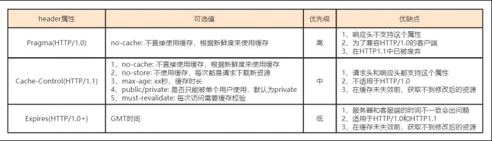
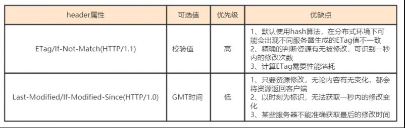

# http
## http缓存
**1、强制缓存**	 
	1、生效则不需要与服务器交互
	2、缓存存放在本地浏览器
	3、http状态码200
	4、决定参数Pragma/Cache-Control/Expires

**2、协商缓存**	 
	1、必须与服务器交互
	2、缓存存放在本地浏览器
	3、http状态码304
	4、决定参数ETag/If-Not-Match / Last-Modified/If-Modified-Since

**3、私有缓存**	 

**4、共享缓存**	 

